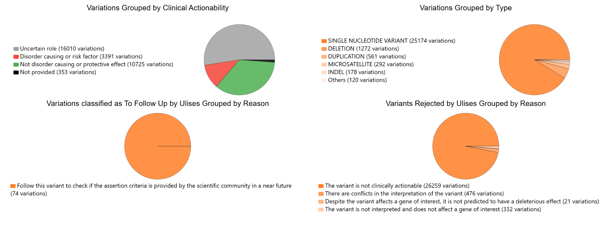
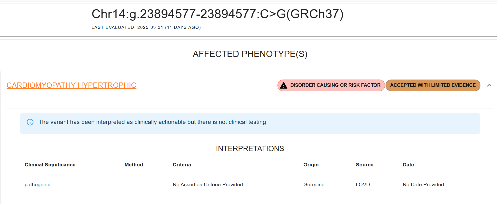

# DGS Final Project

## A. Introduction
Hypertrophic cardiomyopathy (HCM) is when muscle tissue in the heart thickens without a clear cause. This study develops a tool for identifying patients containing genes causing the disease. The project uses the DELFOS platform to find the relevant genes connected to HCM. Project Part I will find the relevant genes, while project Part II will explain the development of an algorithm to identify those genes in a patient file.

## B. Project Part I Results

### Brief overview of variant data collection methodology using Hermes.
The variant data collection for enhancing the DELFOS platform to identify genetic variants associated with Hypertrophic Cardiomyopathy (HCM) utilized the Hermes tool to aggregate data from three key sources: ClinVar, GWAS, and LOVD. ClinVar was the primary contributor, accounting for approximately 80% of the data, and was searched using the "Hypertrophic Cardiomyopathy" phenotype or "hypertrophic" keyword. GWAS provided additional variant data, while LOVD required a targeted search using a list of HCM-relevant genes (MYH7, LOC126861897, MHR1, MYBPC3). After, we integrated the data together and prepared the data for Ulises module. A JSON file was then created with the variants found. An error was encountered during LOVD data retrieval, indicating potential issues with data accessibility or quality, which could affect dataset completeness.


### Summary of clinically relevant variants identified through Ulises.
Using the Ulises tool, 27601 variants related to HCM were analyzed, revealing a distribution of clinical relevance. Of these, 3391 variants (12%) were classified as disorder-causing or risk factors, making them clinically actionable. Additionally, 10725 variants were deemed protective or not disorder-causing, while 16010 (58%) were of uncertain role, requiring further evaluation. A small subset of 74 variants was flagged for follow-up due to pending scientific consensus, and 26259 were rejected, primarily for lacking clinical actionability. The analysis underscores that only a small fraction (11%) are clinically relevant, with just 3% backed by strong evidence, highlighting the need for cautious interpretation.




### Key insights from Sibila visualizations showing variant-clinical relationships.

Sibila module revealed that different HCM phenotypes can affect distinct genes and chromosomes, complicating clinical interpretation. For instance, HCM is strongly correlated with chromosomes 1, 7, and 14. Familial forms, such as Familial Hypertrophic Cardiomyopathy 22, exhibit unique symptoms and genetic profiles, adding complexity to patient assessments. Additionally, variants labeled "Cardiomyopathy Hypertrophic" (sourced only in LOVD) may reflect naming discrepancies rather than distinct phenotypes, as seen in the example variant Chr14:g.23894577-23894577:C>G (GRCh37). These findings emphasize the genetic heterogeneity of HCM and the need for precise data alignment across sources to ensure accurate clinical applications.



## C. Project Part II Results

The solution developed is aimed at extending the Delfos platform to bridge the gap between genetic knowledge and clinical application for Hospital Universitario La Fe. Specifically, this extension focuses on the rapid identification of patients with a genetic predisposition to Hypertrophic Cardiomyopathy (HCM). By processing genetic variant data (VCF files) from both variants and patients, this tool enables the analysis of genetic variants and their associations with clinical phenotypes, ultimately supporting timely clinical intervention.

### Technical overview of your solution.
The solution is built with a PostgreSQL database and Python, incorporating modules like psycopg2 for database interaction and vcfpy for handling VCF (Variant Call Format) files.

The solution creates two database tables. Each have the same columns, but one is used to store data from the variants file extracted from Delfos, while the other is used to store a patient's data examined for hypertrophic cardiomyopathy. Setting up the database is done with the following code:
```python
def setup_database(table):
    query = f"""
    CREATE TABLE IF NOT EXISTS {table} (
        id SERIAL PRIMARY KEY,
        position INT,
        chromosome VARCHAR(255),
        reference VARCHAR(255),
        alternate VARCHAR(255),
        quality FLOAT,
        filter VARCHAR(255),
        info TEXT
    );
    """
    try:
        with psycopg2.connect(**DB_PARAMS) as conn:
            with conn.cursor() as cur:
                cur.execute(query)
                conn.commit()
    except Exception as e:
        print("Database insertion error:", e)
```

The solution then processes both vcf files to insert data into the databases. This is done by using the vcfpy python library. The two following functions iterates the records in the respective vcf files and inserts the necessary information into the database:
```python
def insert_variant(table, chrom, pos, ref, alt, qual, fltr, info):
    query = f"""
    INSERT INTO {table} (chromosome, position, reference, alternate, quality, filter, info)
    VALUES (%s, %s, %s, %s, %s, %s, %s);
    """
    try:
        with psycopg2.connect(**DB_PARAMS) as conn:
            with conn.cursor() as cur:
                cur.execute(query, (chrom, pos, ref, alt, qual, fltr, info))
    except Exception as e:
        print(f"Database insertion error for table {table}: {e}")

def process_vcf(vcf_file):
    reader = vcfpy.Reader.from_path(vcf_file)

    while True:
        try:
            record = next(reader)
            chrom = record.CHROM
            pos = record.POS if record.POS is not None else 1
            ref = record.REF
            alt = ";".join(str(a) for a in record.ALT)
            qual = record.QUAL
            fltr = ";".join(record.FILTER) if record.FILTER else "PASS"
            info = str(record.INFO)

            if vcf_file == variants_vcf_file:
                table = VARIANTS_TABLE
            else:
                table = PATIENTS_TABLE
            insert_variant(table, chrom, pos, ref, alt, qual, fltr, info)

        except StopIteration:
            break
        except ValueError as _:
            continue
```

The comparison algorithm queries the two databases in order to find variants that exist in both. The comparison joins the two tables on whether they have the same chromosome, position, reference allele and alternative allele. This is done with the following query:
```sql
SELECT
    *
FROM
    variants_delfos d
JOIN
    variants_patients p
ON
    d.chromosome = SUBSTRING(p.chromosome FROM 4)
    AND d.position = p.position
    AND d.reference = p.reference
    AND d.alternate = p.alternate;
```

The information we are after is how many matches there are, and what phenotypes are associated as well as the clinical actionability, and interpretation. To extract the most valuable information we select the following:
```sql
SELECT
    json_array_elements_text(REPLACE(d.info, '''', '"')::json -> 'PHENOTYPE') AS phenotype,
    json_array_elements_text(REPLACE(d.info, '''', '"')::json -> 'CLINICAL_ACTIONABILITY') AS clinical_actionability,
    json_array_elements_text(REPLACE(d.info, '''', '"')::json -> 'INTERPRETATION') AS interpretation
FROM
    variants_delfos d
JOIN
    variants_patients p
ON
    d.chromosome = SUBSTRING(p.chromosome FROM 4)
    AND d.position = p.position
    AND d.reference = p.reference
    AND d.alternate = p.alternate;
```

And then we print this information:
```python
print("Number of matches: ", len(results))
for row in results:
    print(f"Phenotype: {row[0]}, Clinical Actionability: {row[1]}, Interpretation: {row[2]}")
```

### Results
#### i) The reporting system structure and the information selected as relevant
The relevant information selected is phenotype, clinical actionability, and interpretation for each match.

The phenotype relates to the specific type of Hypertrophic Cardiomyopathy or other related conditions. The phenotype gives direct insight into how the disease will present in the patient. The different types of HCM could determine treatment, prognosis, and genetic counseling.

Clinical actionability refers to whether the identified genetic variant or phenotype leads to a specific action in the clinical management of the patient. This could involve monitoring, medical treatment, preventive measures, or lifestyle changes. Clinical actionability determines whether the findings from the genetic variants have real-world implications

 Interpretation refers to the clinical significance of the identified variant or phenotype, often categorized by the strength of evidence supporting the variant’s association with the disease. The interpretation of a genetic variant informs us about the level of confidence in the association between the variant and the disease. It could help prioritize clinical actions.

#### ii) The results of the comparison between DELFOS and the patient’s VCF
We get the following results:
```
Number of matches:  4

Phenotype associated:  HYPERTROPHIC CARDIOMYOPATHY 1 , Clinical actionability:  Disorder causing or risk factor , Interpretation:  ACCEPTED WITH MODERATE EVIDENCE

Phenotype associated:  HYPERTROPHIC CARDIOMYOPATHY 4 , Clinical actionability:  Disorder causing or risk factor , Interpretation:  ACCEPTED WITH LIMITED EVIDENCE

Phenotype associated:  PRIMARY FAMILIAL HYPERTROPHIC CARDIOMYOPATHY , Clinical actionability:  Disorder causing or risk factor , Interpretation:  TO FOLLOW UP

Phenotype associated:  HYPERTROPHIC CARDIOMYOPATHY , Clinical actionability:  Disorder causing or risk factor , Interpretation:  ACCEPTED WITH MODERATE EVIDENCE
```
It shows that there are four matches between the DELFOS and the patient's VCF. The patients show disorder causing or risk factor of the phenotypes Hypertrophic Cardiomyopathy, Hypertrophic Cardiomyopathy 1, Hypertrophic Cardiomyopathy 4, and Primary Familial Hypertrophic Cardiomyopathy.
#### iii) Analysis of whether the use case patient presents Hypertrophic Cardiomyopathy
Seeing that the patient has four matches, there is a chance that they present Hypertrophic Cardiomyopathy.

Result 1:
Phenotype associated: HYPERTROPHIC CARDIOMYOPATHY 1
Clinical actionability: Disorder causing or risk factor
Interpretation: ACCEPTED WITH MODERATE EVIDENCE
Interpretation: This result shows that the variant is associated with Hypertrophic Cardiomyopathy 1 which is a form of Hypertrophic Cardiomyopathy. The moderate evidence indicates that there is some level of clinical relevance. Since the variant is clinically actionable it suggests that the patient might present Hypertrophic Cardiomyopathy and that an intervention could be considered.


Result 2:
Phenotype associated: HYPERTROPHIC CARDIOMYOPATHY 4
Clinical actionability: Disorder causing or risk factor
Interpretation: ACCEPTED WITH LIMITED EVIDENCE
Interpretation: The result points to Hypertrophic Cardiomyopathy 4 which is another variant of Hypertrophic Cardiomyopathy. The limited evidence means that the association is not fully established but still suggests a connection to Hypertrophic Cardiomyopathy. This could imply that the patient presents Hypertrophic Cardiomyopathy. Clinical action could be considered, but with caution because of the limited data.

Result 3:
Phenotype associated: PRIMARY FAMILIAL HYPERTROPHIC CARDIOMYOPATHY
Clinical actionability: Disorder causing or risk factor
Interpretation: TO FOLLOW UP
Interpretation: The result indicates a primary familial form of Hypertrophic Cardiomyopathy, which suggests a heritable form of the disease. The follow-up recommendation suggests that more research or monitoring is needed before making a definitive clinical decision. However, this finding can be important for tracking potential familial heritability of Hypertrophic Cardiomyopathy.

Result 4:
Phenotype associated: HYPERTROPHIC CARDIOMYOPATHY
Clinical actionability: Disorder causing or risk factor
Interpretation: ACCEPTED WITH MODERATE EVIDENCE
Interpretation: This result shows a general association with Hypertrophic Cardiomyopathy, with moderate evidence supporting its clinical relevance. The variant is likely linked to the disease, and clinical action is recommended.

Because of these results, the patient seems to have some variants linked to Hypertrophic Cardiomyopathy and clinical action is recommended. It is clear that the patient may have some kind of genetic predisposition to Hypertrophic Cardiomyopathy. Especially since there are multiple variant matches, and since result 1 and 4 show moderate evidence supporting a link to HCM and actionable clinical implications. The patient's risk for developing or passing on Hypertrophic Cardiomyopathy should be evaluated by healthcare professionals.

In conclusion, the patient likely has some form of Hypertrophic Cardiomyopathy risk, and appropriate clinical intervention or monitoring should be pursued.
#### iv) Conclusions about the clinical utility of DELFOS for Hypertrophic Cardiomyopathy.
The DELFOS platform provide valuable data of variants potentially connected to Hypertrophic Cardiomyopathy. And together with this solution, we can easily detect if a patient matches any of those genes.

## D. Conclusions and Future Work

### Conclusions

Strong correlations with chromosomes 1, 7, and 14, alongside diverse phenotypes like familial HCM, underscore the disease’s genetic heterogeneity, requiring more complex clinical approaches. The identification of four HCM-related variants in a patient, with moderate to limited evidence, indicates a genetic predisposition requiring clinical evaluation. These insights affirm DELFOS’s potential to guide precision medicine, though the high uncertainty in variant roles emphasizes the need for improved classification.

### Future Work

#### Advanced Reporting System:
Expand the reporting system to include a summarized risk score for HCM based on the number, actionability, and evidence strength of matched variants. This would provide clinicians with a clearer decision-making tool. Incorporate patient-specific recommendations based on phenotype and clinical actionability.

#### Scalability and Automation:
Optimize the PostgreSQL database and comparison algorithm for scalability to handle larger patient cohorts and multi-disease analyses. Automate the VCF processing pipeline to reduce manual intervention and enable real-time analysis in clinical settings.


#### User Interface Development:
Create a user-friendly interface for users to input patient VCF files, view results, and access visualizations of variant-clinical relationships, enhancing accessibility for non-technical users.

## References
[1] H. Cui and H. V. Schaff, “80. Hypertrophic cardiomyopathy,” in Cardiac Surgery: A Complete Guide, S. G. Raja, Ed. Switzerland: Springer, 2020, pp. 735–748.
